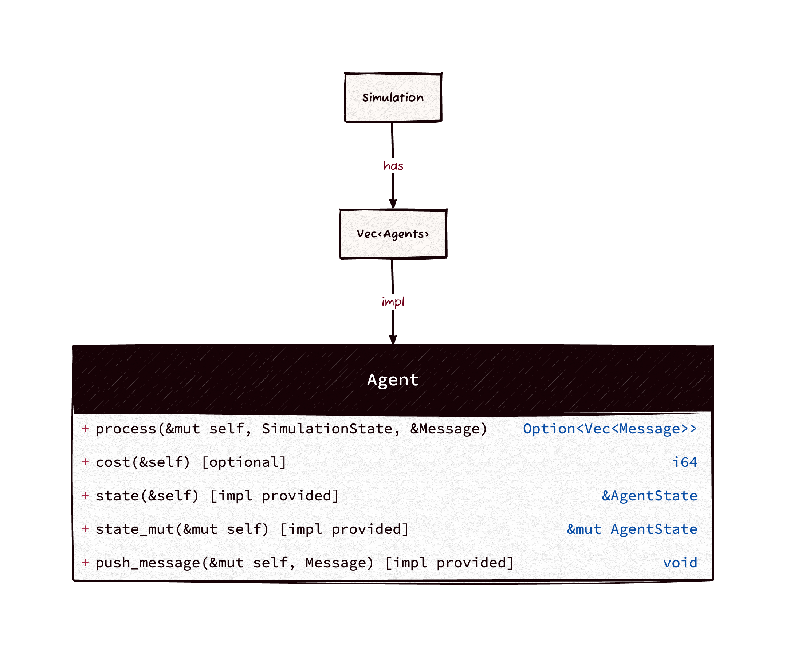
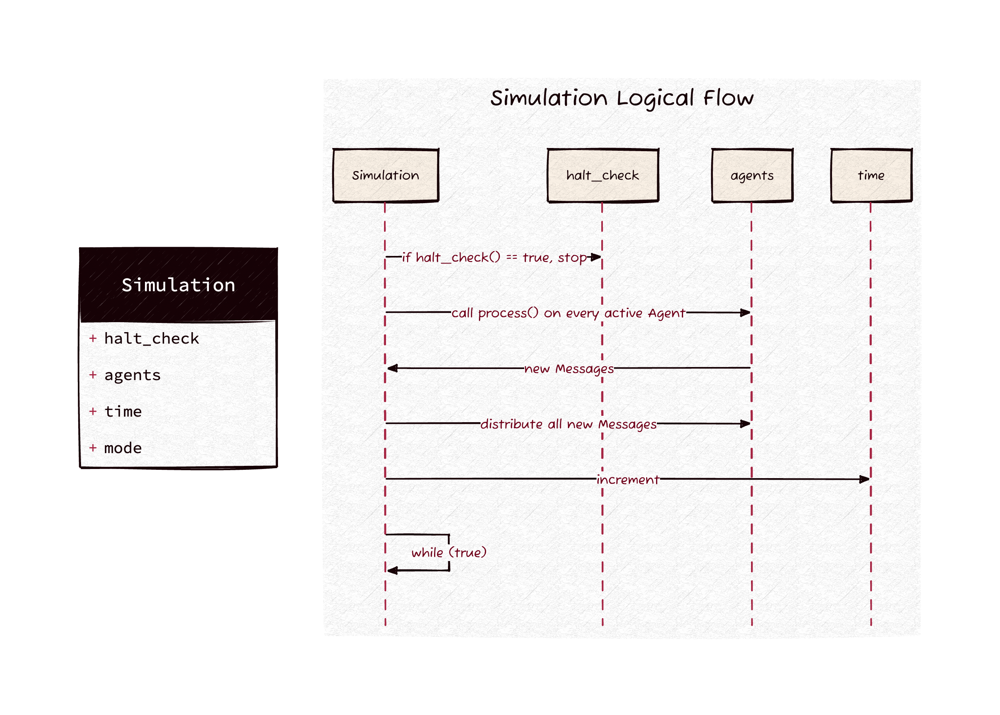

`simul` is a discrete-event simulation library aimed at high-level use-cases to
quickly simulate real-world problems and run simulated experiments.

`simul` is a *discrete-event simulator* using *incremental time progression*,
with [M/M/c queues](https://en.wikipedia.org/wiki/M/M/c_queue) for interactions
between agents. It also supports some forms of experimentation and simulated
annealing to replicate a simulation many times, varying the simulation
parameters.

Use-cases:
- [Discrete-event simulation](https://en.wikipedia.org/wiki/Discrete-event_simulation)
- [Complex adaptive systems](https://authors.library.caltech.edu/60491/1/MGM%20113.pdf)
- [Simulated annealing](https://en.wikipedia.org/wiki/Simulated_annealing)
- [Job-shop scheduling](https://en.wikipedia.org/wiki/Job-shop_scheduling)
- [Birth-death processes](https://en.wikipedia.org/wiki/Birth%E2%80%93death_process)
- [Computer experiments](https://en.wikipedia.org/wiki/Computer_experiment)
- Other: simulating logistics, operations research problems, running experiments
  to approximate a global optimum, simulating queueing systems, distributed
  systems, performance engineering/analysis, and so on.

# Usage

> **Warning**
>
> Experimental and unstable. Almost all APIs are expected to change.

- For some examples, see the `examples` subdirectory.
- For use cases where your agents need their own custom state, define a struct
  and use the `#[simul_macro::agent]` macro and pass those agents to the
  `Simulation`.

## Basic usage

``` toml
[dependencies]
simul = "0.4.1"
```

``` rust
use simul::Simulation;
use simul::agent::*;

// Runs a simulation with a producer that produces work at every tick of
// discrete time (period=1), and a consumer that cannot keep up (can only
// process that work every third tick).
let mut simulation = Simulation::new(SimulationParameters {
    // We pass in two agents:
    //   one that produces -> consumer every tick
    //   one that simply consumes w/ no side effects every third tick
    agents: vec![
        periodic_producing_agent("producer".to_string(), 1, "consumer".to_string()),
        periodic_consuming_agent("consumer".to_string(), 3),
    ],
    // You can set the starting epoch for the simulation. 0 is normal.
    starting_time: 0,
    // Whether to collect telemetry on queue depths at every tick.
    // Useful if you're interested in backlogs, bottlenecks, etc. Costs performance.
    enable_queue_depth_metric: true,
    /// Records a metric on the number of cycles agents were asleep for.
    enable_agent_asleep_cycles_metric: true,
    // We pass in a halt condition so the simulation knows when it is finished.
    // In this case, it is "when the simulation is 10 ticks old, we're done."
    halt_check: |s: &Simulation| s.time == 10,
});

simulation.run();
```

## Simulation Concepts / Abstraction

A simulation is a collection of `Agents` that interact with each other via
`Messages`. The simulation keeps a discrete time (u64) which is incremented on
each tick of the Simulation. What an `Agent` does at each tick of the simulation
is provided by you in its `process()` method. `process()` means an `Agent`
processes one of the messages in its queue. Each `Agent` must have a unique
string id. If an `Agent` wants to interact with another `Agent`, it can return a
`Message` from `process` with that other agent as a `target`.



The simulation runs all the logic of calling `process()`, distributing messages,
tracking metrics, incrementing time, and when to halt. A `Simulation` is
finished when the provided `halt_check` function returns `true`, or if an
`Agent` responds with a special `Interrupt` to halt the `Simulation`.



## Poisson-distributed example w/ Plotting

Here's an example of an outputted graph from a simulation run. In this
simulation, we show the average waiting time of customers in a line at a
cafe. The customers arrive at a Poisson-distributed arrival rate
(`lambda<-60.0`) and a Poisson-distributed coffee-serving rate with the
same distribution.

This simulation maps to the real world by assuming one tick of
discrete-simulation time is equal to one second.

Basically, the barista serves coffees at around 60 seconds per drink and
the customers arrive at about the same rate, both modeled by a
stochastic Poisson generator.

This simulation has a `halt_check` condition of the simulation's time
being equal to `60*60*12`, representing a full 12-hour day of the cafe
being open.


This is a code example for generating the above.

``` rust
use plotters::prelude::*;
use rand_distr::Poisson;
use simul::agent::*;
use simul::*;
use std::path::PathBuf;

fn main() {
    run_example_cafe_simulation();
}

fn run_example_cafe_simulation() -> Result<(), Box<dyn std::error::Error>> {
    let mut simulation = Simulation::new(SimulationParameters {
        agents: vec![
            poisson_distributed_consuming_agent("Barista".to_string(), Poisson::new(60.0).unwrap()),
            poisson_distributed_producing_agent(
                "Customers".to_string(),
                Poisson::new(60.0).unwrap(),
                "Barista".to_string(),
            ),
        ],
        starting_time: 0,
        enable_queue_depth_metric: true,
        halt_check: |s: &Simulation| s.time == 60 * 60 * 12,
    });

    simulation.run();

    plot_queued_durations_for_processed_messages(
        &simulation,
        &["Barista".into()],
        &"/tmp/cafe-example-queued-durations.png".to_string().into(),
    )
}
```

# Contributing

Issues, bugs, features are tracked in TODO.org
